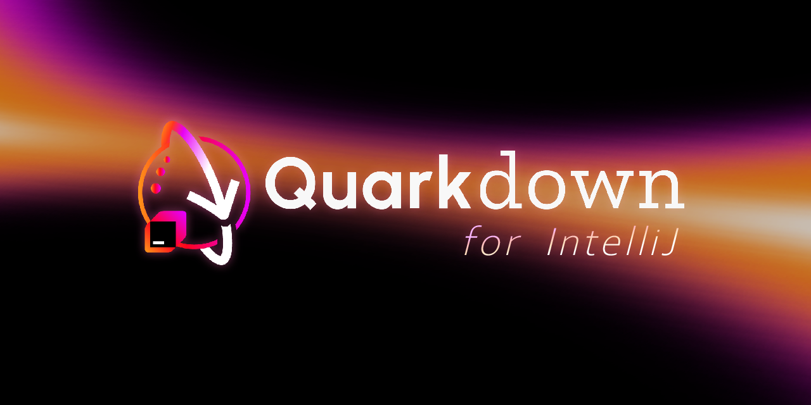
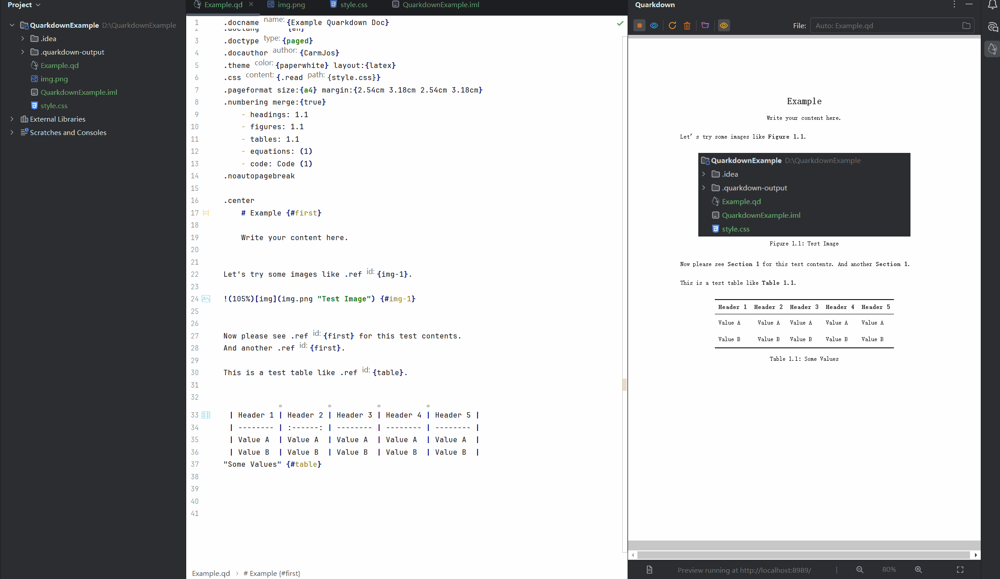
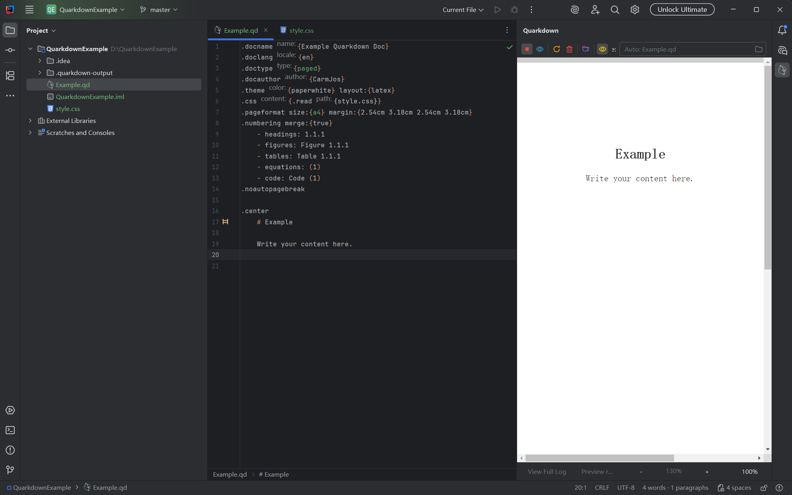
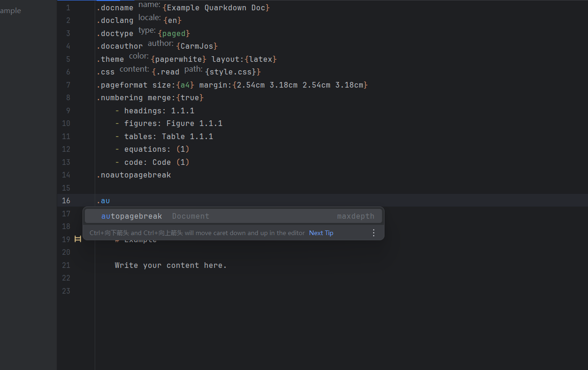
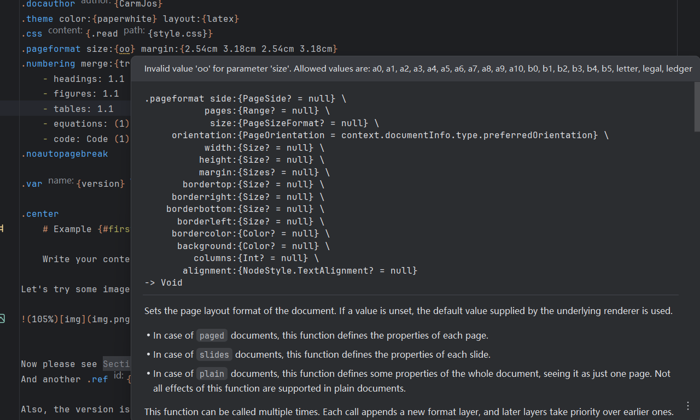
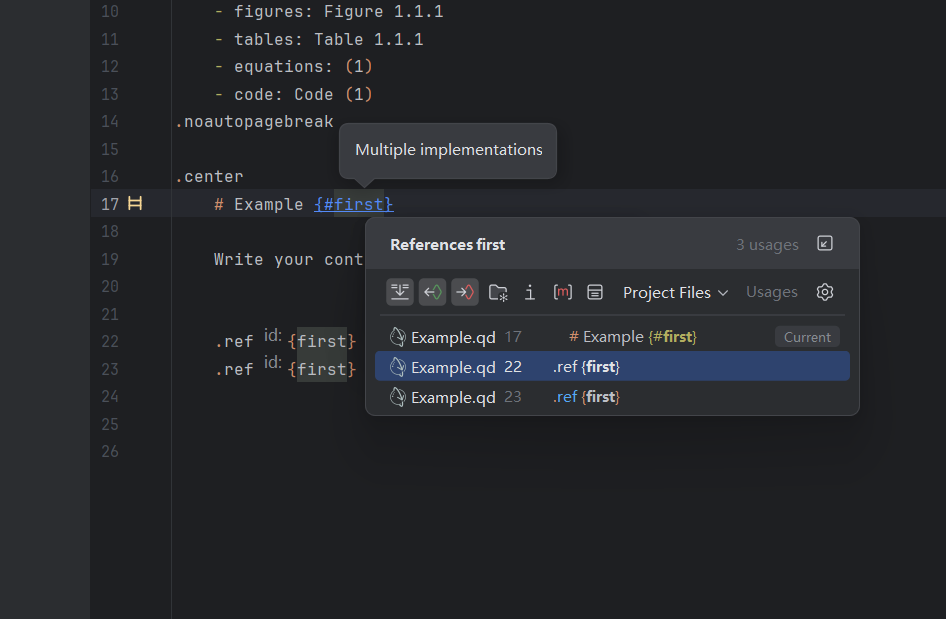
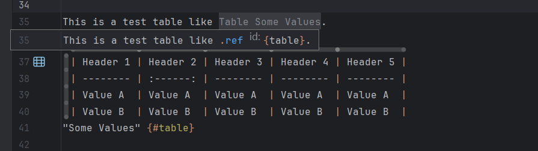
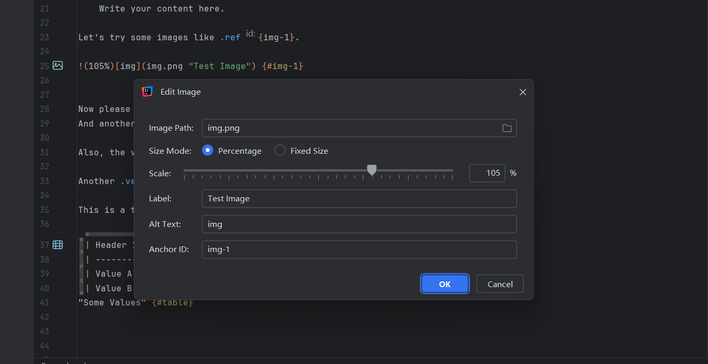
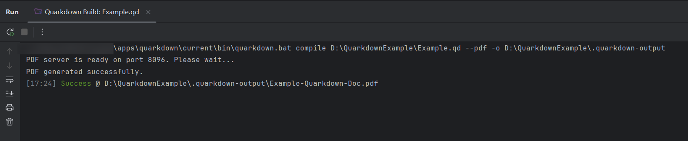
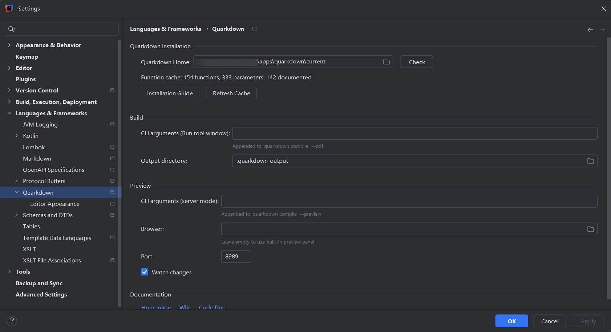

README LANGUAGES [ [**English**](README.md) | [**中文**](README_zh.md) ]

# **Quarkdown** _for IntelliJ_

_**"Quarkdown language support for JetBrains IntelliJ Platform."**_

An IntelliJ IDEA plugin that provides comprehensive support for [Quarkdown](https://github.com/iamgio/quarkdown) language syntax with `.qd` files,
enabling developers to write and edit Quarkdown documents with full IDE assistance.

> Also see the [VS Code extension](https://quarkdown.com/vs-code) for Quarkdown support in Visual Studio Code.

## Features & Advantages

### Writing & Editing

- **Write in real time** — watch your Quarkdown document take shape with live editing, completion and formatting.

  

  
View the demo

  

  

- **Full Syntax Highlighting** — Every Quarkdown directive and Markdown element is color-highlighted in the editor, using a dedicated color scheme you can fully customize to suit your taste.

  

  
View screenshot

  

  

- **Smart Code Completion** — As you type, get instant suggestions for functions, parameters, and file paths, together with documentation tooltips and parameter hints so you can write faster and more accurately.

  

  
View screenshot

  

  

- **Real-time Error Detection** — Unknown functions, invalid parameters, missing arguments, and undefined references are flagged in the editor the moment they appear, so problems are caught before they reach the final document.

  

  
View screenshot

  

  

- **Effortless Navigation** — Jump from a reference to its definition, find every usage of a label, rename it everywhere at once, and navigate into included or referenced files with a single click.

  

  
View screenshot

  

  

- **Document Overview** — A structure view and breadcrumbs show the outline of chapters, tables, and images, while code folding lets you collapse long sections for focused editing.

  

  
View screenshot

  

  

### Smart Editing

- **Visual Table Editing** — Insert, remove, move, select, and align table rows and columns from floating handles and a toolbar, and edit any table in a spreadsheet-style dialog that converts between Markdown pipe tables and `.tablebyrows` calls — without ever touching the raw table syntax.
- **Convenient Image Handling** — Drag and drop or paste images directly into the document; the correct syntax is generated for you, image sizes can be adjusted visually, and invalid paths are called out.

  

  
View screenshot

  

  

- **Effortless Editing** — Comment lines quickly with a shortcut, and enjoy auto-closing of paired symbols such as `{}`, `[]`, and quotes.
- **Handy Formatting Shortcuts** — Commonly used operations such as bold, italic, strikethrough, code blocks, links, images, and tables are just one keypress away, making formatting quick and effortless.
- **File Assistance** — Path completion and existence checks for included files, images, and cross-references help you wire documents together without typos.
- **Live Word Count** — A word and paragraph counter in the status bar keeps track of your progress as you write (excluding function calls and code blocks).

### Preview & Build

- **Quick Preview Panel** — A fast preview panel right inside the IDE that refreshes automatically whenever you save, letting you see the rendered result while you write.
- **External Browser Preview** — Prefer a real browser? Open the live preview in your default browser with a single click.
- **One-click Build** — Turn your document into final output such as PDF straight from the IDE's Run window, using your own compile options.

  

  
View screenshot

  

  

- **Auto-compile on Save** — Documents are recompiled automatically when you save, so the preview and build output are always up to date.
- **Dedicated Run Configuration** — A dedicated run configuration for `.qd` files makes compiling and previewing your document as simple as pressing Run.

### Integration & Management

- **Instant File Creation** — Create new Quarkdown documents right from the File → New menu with a ready-made template.
- **Centralized Settings** — Configure the Quarkdown installation path and compile/preview options from one settings page.

  

  
View screenshot

  

  

- **Bilingual Interface** — The entire plugin UI is available in both English and Chinese.

## Installation

### From JetBrains Marketplace _(Recommended)_

1. Open IntelliJ IDEA
2. Go to `Settings/Preferences` → `Plugins`
3. Search for "[Quarkdown](https://plugins.jetbrains.com/plugin/33459)"
4. Click `Install` and restart the IDE

### From Disk

1. Download the latest release from [GitHub Releases][gh:releases]
2. Open IntelliJ IDEA
3. Go to `Settings/Preferences` → `Plugins`
4. Click the gear icon → `Install Plugin from Disk...`
5. Select the downloaded `.zip` file and restart the IDE

## Requirements

- Any JetBrains IntelliJ Platform product **2025.2 or later** — IntelliJ IDEA (Community & Ultimate), Android Studio, PyCharm, WebStorm, PhpStorm, GoLand, RubyMine, CLion, Rider, DataSpell, DataGrip, RustRover, JetBrains Gateway, JetBrains Client, and Code With Me Guest.
- [Quarkdown CLI](https://github.com/iamgio/quarkdown) installed and available in `PATH` or configured in plugin settings.
- [LSP4IJ](https://plugins.jetbrains.com/plugin/23257-lsp4ij) — installed automatically by the JetBrains Marketplace when installing this plugin from the plugin repository.

## Support and Donation

If you appreciate this plugin, consider supporting me with a donation at 
[GitHub Sponsors](https://github.com/sponsors/CarmJos) or
[爱发电](https://www.ifdian.net/a/carmjos/plan) !

**Thank you for supporting open-source projects!**

Many thanks to JetBrains for kindly providing a license for us to work on this and other open-source projects.

## Contributing

Contributions are welcome! Please feel free to submit a Pull Request. For major changes, please open an issue first to discuss what you would like to change.

Please make sure to update tests as appropriate.

## Open Source License

This project's source code is licensed under
the [GNU General Public License, Version 3](https://www.gnu.org/licenses/gpl-3.0.html).

[gh:releases]: https://github.com/CarmJos/quarkdown-for-intellij/releases
